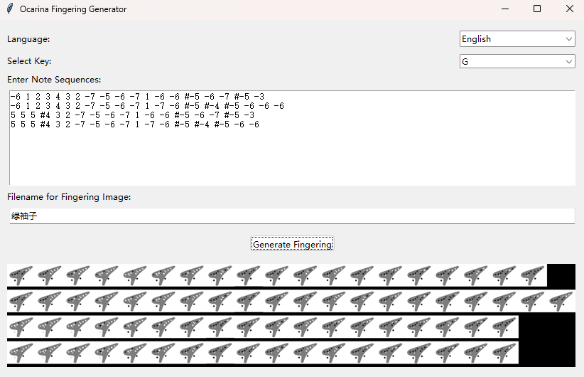

# Ocarina Fingering Generator


## Introduction | 介绍 | 紹介

### English

The Ocarina Fingering Generator is a tool designed to help ocarina players easily generate fingering charts for various notes in different keys. This tool supports multiple keys, including G, C, D, F, A, bB, and bE, and allows users to input sequences of notes to visualize the corresponding fingerings.

### 中文

陶笛指法生成器是一款帮助陶笛演奏者轻松生成不同调号下各种音符指法图表的工具。该工具支持多个调号，包括G调、C调、D调、F调、A调、bB调和bE调，并允许用户输入音符序列以可视化相应的指法。

### 日本語

オカリナ指使い生成プログラムは、オカリナ奏者がさまざまなキーの異なる音符の指使いチャートを簡単に生成するのを支援するツールです。このツールは、G、C、D、F、A、bB、およびbEの複数のキーをサポートしており、ユーザーが音符のシーケンスを入力して、対応する指使いを視覚化できます。

## Features | 功能 | 機能

- **Support for Multiple Keys | 支持多种调号 | 複数のキーに対応**: Generate fingering charts for G, C, D, F, A, bB, and bE keys.
- **Multi-Line Input | 多行输入 | 複数行入力**: Enter multiple lines of notes, and the tool will generate a fingering chart for each line.
- **Customizable Output | 可定制的输出 | カスタマイズ可能な出力**: Save the generated fingering charts as image files with custom filenames.
- **Multi-Language Support | 多语言支持 | 多言語対応**: Choose from English, Simplified Chinese, or Japanese for the user interface.

## Installation | 安装 | インストール

### English

1. **Download the Installer**: You can download the installer from the [latest release](https://github.com/ValleyC/OcarinaFingeringGenerator/releases) on GitHub.

2. **Run the Installer**:
   - Double-click the `OcarinaFGSetup.exe` file to start the installation.
   - Follow the on-screen instructions to complete the installation process.

3. **Launch the Application**:
   - Once installed, you can launch the Ocarina Fingering Generator from the Start Menu or a desktop shortcut.

### 中文

1. **下载安装程序**: 您可以从GitHub的[最新版本](https://github.com/ValleyC/OcarinaFingeringGenerator/releases)下载安装程序。

2. **运行安装程序**:
   - 双击 `OcarinaFGSetup.exe` 文件开始安装。
   - 按照屏幕上的说明完成安装过程。

3. **启动应用程序**:
   - 安装完成后，您可以从“开始”菜单或桌面快捷方式启动陶笛指法生成器。

### 日本語

1. **インストーラーのダウンロード**: GitHubの[最新リリース](https://github.com/ValleyC/OcarinaFingeringGenerator/releases)からインストーラーをダウンロードできます。

2. **インストーラーを実行する**:
   - `OcarinaFGSetup.exe`ファイルをダブルクリックしてインストールを開始します。
   - 画面上の指示に従ってインストールプロセスを完了します。

3. **アプリケーションの起動**:
   - インストール後、「スタート」メニューまたはデスクトップショートカットからオカリナ指使い生成プログラムを起動できます。

## Usage | 使用方法 | 使い方

### English

1. **Open the Application**:
   - Launch the Ocarina Fingering Generator from the Start Menu or desktop shortcut.

2. **Select the Language**:
   - Choose your preferred language from the dropdown menu at the top left of the application window. Available languages are English, Simplified Chinese (中文), and Japanese (日本語).

3. **Select the Key**:
   - Choose the key from the dropdown menu labeled "Key". Supported keys are G, C, D, F, A, bB, and bE.

4. **Enter the Note Sequences**:
   - In the text box labeled "Enter Note Sequences," input the notes for which you want to generate fingerings.
   - Notes should be separated by spaces, and each line will represent a new sequence of notes.
   - Example input: 
     ```
     -2 3 4 #5 6
     1 2 #4 5 #6
     ```

5. **Specify the Output Filename**:
   - In the "Filename" field, enter the name for the output file (without the `.png` extension). The generated fingering chart will be saved as a PNG image.

6. **Generate the Fingering Chart**:
   - Click the "Generate Fingering Chart" button to create the fingering chart.
   - The generated image will be displayed within the application window, and saved to the specified file.

### 中文

1. **打开应用程序**:
   - 从“开始”菜单或桌面快捷方式启动陶笛指法生成器。

2. **选择语言**:
   - 从应用程序窗口左上角的下拉菜单中选择您的首选语言。可用的语言有英文、简体中文（中文）和日文（日本語）。

3. **选择调号**:
   - 从标记为“调号”的下拉菜单中选择调号。支持的调号包括G调、C调、D调、F调、A调、bB调和bE调。

4. **输入音符序列**:
   - 在标有“输入音符序列”的文本框中，输入要生成指法的音符。
   - 音符应以空格分隔，每一行代表一组新的音符序列。
   - 示例输入:
     ```
     -2 3 4 #5 6
     1 2 #4 5 #6
     ```

5. **指定输出文件名**:
   - 在“文件名”字段中输入输出文件的名称（不带 `.png` 扩展名）。生成的指法图将以 PNG 图像格式保存。

6. **生成指法图**:
   - 点击“生成指法图”按钮生成指法图。
   - 生成的图像将在应用程序窗口中显示，并保存到指定的文件中。

### 日本語

1. **アプリケーションを開く**:
   - 「スタート」メニューまたはデスクトップショートカットからオカリナ指使い生成プログラムを起動します。

2. **言語を選択する**:
   - アプリケーションウィンドウの左上隅にあるドロップダウンメニューから、希望の言語を選択します。使用可能な言語は、英語、簡体字中国語（中文）、および日本語（日本語）です。

3. **キーを選択する**:
   - 「Key」とラベル付けされたドロップダウンメニューからキーを選択します。サポートされているキーはG、C、D、F、A、bB、およびbEです。

4. **音符のシーケンスを入力する**:
   - 「Enter Note Sequences」とラベル付けされたテキストボックスに、指使いを生成したい音符を入力します。
   - 音符はスペースで区切る必要があり、各行は新しい音符のシーケンスを表します。
   - 例:
     ```
     -2 3 4 #5 6
     1 2 #4 5 #6
     ```

5. **出力ファイル名を指定する**:
   - 「ファイル名」フィールドに、出力ファイルの名前を入力します（`.png`拡張子は含まない）。生成された指使いチャートはPNG画像として保存されます。

6. **指使いチャートを生成する**:
   - 「Generate Fingering Chart」ボタンをクリックして、指使いチャートを作成します。
   - 生成された画像はアプリケーションウィンドウ内に表示され、指定されたファイルに保存されます。

## Example Output | 示例输出 | 出力例


